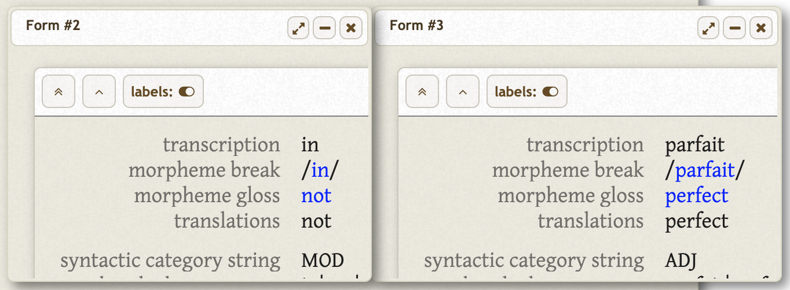

================================================================================
  Building Morphological Parsers using DativeBase
================================================================================

--------------------------------------------------------------------------------
 Joel Dunham — June 7, 2019
--------------------------------------------------------------------------------

.. image:: images/old-logo.png
   :width: 25%
   :alt: OLD (DativeBase) logo image
   :align: right

In this post, we will learn how to create morphological parsers using
DativeBase_. A morphological parser is a tool that takes a word like
*impermissible* and returns a morphological analysis of that word, for example,
*/in-permit-able/*.

Morphological analysis is an initial processing step often required by more
sophisticated Natural Language Processing (NLP) tasks, such as machine
translation. In languages with complex morphology, such as Turkish, Blackfoot
or Arabic, morphological parsing/analysis is relatively more important. In
some contexts, for example, when analyzing and documenting understudied or
ancient languages, morphological analysis is an end in itself.

DativeBase (Dative_ plus the `Online Linguistic Database`_) is a suite of tools
that helps linguists and language students to analyze, document and organize
data related to a language under study. Users of DativeBase create collections
of words and sentences, often annotating those words and sentences with
morphological analyses.

One of DativeBase's features is functionality that helps users to build
morphological parsers for their language. This document describes how to do
that, using a small subset of French. It contains working code to assist
with the process.

.. contents::
   :depth: 1

Overview
================================================================================

If you follow this tutorial, you will install DativeBase on your local machine
and build your morhpological parser and its components locally. This requires
that you have `Docker and Docker Compose installed`_ on your system. On my
machine (Mac OS X 10.14 Mojave) I have Docker 18.09 and Docker Compose 1.23
installed:

.. code:: console

   $ docker -v
   Docker version 18.09.2, build 6247962
   $ docker-compose -v
   docker-compose version 1.23.2, build 1110ad01

.. Note:: this could all be done using Dative and an OLD instance that is being
          served on the web. However, doing it locally gives us better
          performance (no network latency) and the freedom to experiment on
          local data without worrying about potentially messsing up the curated
          data sets of any of our collaborators.

The high-level steps that this tutorial takes you through are as follows.

1. Install DativeBase locally.
2. Add some test data to our toy French OLD instance.
3. Compose a phonology in DativeBase
4. Generate a morphology in DativeBase using your language data
5. Generate a morpheme language model (LM) in DativeBase using your language
   data
6. Compose the phonology, morphology and LM into a morphological parser
7. Use the parser in Dative's interface during data entry

Install DativeBase locally
================================================================================

This section details how to install DativeBase locally on your machine. These
instrucions should work on Unix, i.e., Linux and Mac OS. Those using Windows
will have to make the usual adjustments. Similar instructions can be found in
the `DativeBase README`_.

First, clone the `DativeBase source`_ and change into its ``docker-compose/``
directory:

.. code:: console

   $ git clone https://github.com/dativebase/dativebase.git
   $ cd dativebase/docker-compose/

For now, checkout the ``dev/issue-4-offline`` branch.

.. code:: console

   $ git checkout -b dev/issue-4-offine origin/dev-issue-4-offline
   $ git status
   On branch dev/issue-4-offline
   $ git log -1
   commit a2cedbba9f967057cdd88c3dacbe409b50e9feda

.. note:: TODO: Use a stable branch branch (master) for the above.

Fetch the Git submodules containing the Dative and OLD source, if you haven't
done so already:

.. code:: console

   $ git submodule update --init --recursive

Build and bring up the Docker containers that run DativeBase's services
(viz., the OLD web service, the Dative app, MySQL and the Nginx web server):

.. code:: console

   $ make create-volumes
   $ docker-compose up -d --build

If the above was successful, then Docker Compose should show that all services
are up and running:

.. code:: console

   $ docker-compose ps
            Name                        Command               State                       Ports                     
   -----------------------------------------------------------------------------------------------------------------
   docker-compose_dative_1   /bin/sh -c grunt serve           Up      0.0.0.0:61080->9000/tcp                       
   docker-compose_mysql_1    /docker-entrypoint.sh mysqld     Up      0.0.0.0:61002->3306/tcp                       
   docker-compose_nginx_1    nginx -g daemon off;             Up      0.0.0.0:61000->80/tcp, 0.0.0.0:61001->8000/tcp
   docker-compose_old_1      /venv/bin/pserve --reload  ...   Up      0.0.0.0:61081->8000/tcp                       

Now we can create an OLD instance for our toy French data. This will create the
MySQL database (called ``toyfrench``) and the needed tables in our MySQL
container, as well as the filesystem directory structure in our OLD service
container:

.. code:: console

   $ make create-old-instance OLD_NAME=toyfrench

Restart the services for good measure:

.. code:: console

   $ make restart-dativebase-services

We can interact with the MySQL database by using the ``db`` Make rule:

.. code:: console

   $ make db
   mysql>

.. code:: mysql

   mysql> use toyfrench
   Database changed
   mysql> show tables;
   +-----------------------------+
   | Tables_in_toyfrench         |
   +-----------------------------+
   | applicationsettings         |
   | ...                         |
   | form                        |
   | ...                         |
   | userform                    |
   +-----------------------------+
   40 rows in set (0.00 sec)
   mysql> select * from form;
   Empty set (0.01 sec)

If all of the above worked, we should have a local Dative app being served at
`http://127.0.0.1:61000/ <http://127.0.0.1:61000/>`_. Our local toy French OLD
instance will have its HTTP API being served at
`http://127.0.0.1:61001/toyfrench/ <http://127.0.0.1:61001/toyfrench/>`_.

In order to access our toy French OLD instance from Dative, we have to first
tell Dative that it exists. Follow these steps.

1. Navigate to our local Dative at
   `http://127.0.0.1:61000/ <http://127.0.0.1:61000/>`_.
2. Click on `Dative > Application Settings` in the top menu.
3. Click on the `Servers` button.
4. Click on the `create a new server` plus sign button (`+`) to create a new
   server.
5. In the `Name` field, enter the value `Toy French`.
6. In the `URL` field, enter the `http://127.0.0.1:61001/toyfrench`.

To confirm that we can login to our local toy French OLD via the Dative GUI,
perform the following steps:

1. Navigate to our local Dative at
   `http://127.0.0.1:61000/ <http://127.0.0.1:61000/>`_.
2. Click the lock icon (or use keyboard shortcut CTRL+L) to begin logging in.
3. Choose the server that we just configured: `Toy French`.
4. Enter username `admin`.
5. Enter password `adminA_1`.
6. Click the "Login" button.

Add some test data to our toy French OLD instance
================================================================================

We are going to write a morphological parser for a very small subset of French
morphology. We will be looking at a small set of adjectives and a handful of
morphemes that can be prefixed to those adjectives. A prototypical example is
the adjective *imparfait* meaning 'imperfect', which may be morphologically
analyzed as the adjective *parfait* 'perfect' with the negative modifier *in*
'not' prefixed to it.

Below is the Interlinear Glossed Text (IGT) representation of the French
adjective *imparfait*.

    +----------------+---------------+
    | transcription  | *imparfait*   |
    +----------------+---------------+
    | morpheme break | *in-parfait*  |
    +----------------+---------------+
    | morpheme gloss | *not-perfect* |
    +----------------+---------------+
    | categories     | *MOD-ADJ*     |
    +----------------+---------------+
    | translation    | 'imperfect'   |
    +----------------+---------------+

In IGT, words and sentences are displayed with multiple layers, or tiers. The
IGT tiers used above are elaborated below.

- transcription: how the word is spelled
- morpheme break: the shapes of the morphemes within the word
- morpheme gloss: shorthand translations (in English) of each morpheme in the
  *morpheme break* tier
- categories: the category (part-of-speech) of each morpheme in the *morpheme
  break* tier.
- translation: a translation of the word into English

In DativeBase, *forms*, such as words, are also displayed in IGT format:

The morphemes *within* the word *'imparfait'* may also be displayed as IGT:

    +----------------+---------------+---------------+
    | transcription  | *in*          | *parfait*     |
    +----------------+---------------+---------------+
    | morpheme break | *in*          | *parfait*     |
    +----------------+---------------+---------------+
    | morpheme gloss | *not*         | *perfect*     |
    +----------------+---------------+---------------+
    | categories     | *MOD*         | *ADJ*         |
    +----------------+---------------+---------------+
    | translation    | 'not'         | 'perfect'     |
    +----------------+---------------+---------------+

Our goal in building a morphological parser for our subset of French morphology
is to build a program that, when given a *transcription* of a word like
*'imparfait'* as input, will return as output the correct values for the
*morpheme break*, *morpheme gloss*, and *categories* tiers, i.e., 'in-parfait',
'not-perfect', 'MOD-ADJ'.

We will be focusing on four morphemes that can be prefixed to adjectives in
French: *in* 'not', *non* 'not', *syn* 'with', and *bien* 'well'.

    +----------------+-------+-------+--------+--------+
    | transcription  | *in*  | *non* | *syn*  | *bien* |
    +----------------+-------+-------+--------+--------+
    | morpheme break | *in*  | *non* | *syn*  | *bien* |
    +----------------+-------+-------+--------+--------+
    | morpheme gloss | *not* | *not* | *with* | *well* |
    +----------------+-------+-------+--------+--------+
    | categories     | *MOD* | *MOD* | *MOD*  | *MOD*  |
    +----------------+-------+-------+--------+--------+
    | translation    | 'not' | 'not' | 'with' | 'well' |
    +----------------+-------+-------+--------+--------+

These morphemes all *end* in 'n', an alveolar nasal. Our set of adjectives
contains a subset whose members all *begin* with a labial consonant, i.e., one
produced with the lips, i.e., 'b', 'm', 'p', or 'w' and a subset whose members
are non-labial, i.e. all the rest. Here are some labial-initial French
adjectives:

    +----------------+---------------+---------------+-----------+-----------+
    | transcription  | *troublée*    | *calculable*  | *pareil*  | *parfait* |
    +----------------+---------------+---------------+-----------+-----------+
    | morpheme break | *troublée*    | *calculable*  | *pareil*  | *parfait* |
    +----------------+---------------+---------------+-----------+-----------+
    | morpheme gloss | *troubled*    | *calculable*  | *same*    | *perfect* |
    +----------------+---------------+---------------+-----------+-----------+
    | categories     | *ADJ*         | *ADJ*         | *ADJ*     | *ADJ*     |
    +----------------+---------------+---------------+-----------+-----------+
    | translation    | 'troubled'    | 'calculable'  | 'same'    | *perfect* |
    +----------------+---------------+---------------+-----------+-----------+

We are going to add some morphemes, words and phrases to our toy French OLD.
Morphemes are indivisible (atomic) units of meaning. In this example, we will
be adding some French nouns (e.g., `chien`), number (e.g., plural) affixes
(e.g., `-s`) and articles (e.g., `le`) to our local toy French OLD.

.. code:: json

   [
     {"transcription": "chien",
      "morpheme_break": "chien",
      "morpheme_gloss": "dog",
      "translations": [{"transcription": "dog"}]},
     {"transcription": "le",
      "morpheme_break": "le",
      "morpheme_gloss": "DET.M",
      "translations": [{"transcription": "the"}]},
     {"transcription": "s",
      "morpheme_break": "s",
      "morpheme_gloss": "PL",
      "translations": [{"transcription": "plural"}]},
   ]

We will also be adding words and phrases that are analyzed using these
morphemes. The following JSON data structure illustrates what we will be adding:

In the context of the DAILP Cherokee project, we can ingest the DAILP Cherokee
language data into our local OLD using the DAILP Ingest tool dailp-ingest-clj
whose source is at::

    https://github.com/dativebase/dailp-ingest-clj

I cloned the dailp-ingest-clj source, and checked out the master branch at the
commit indicated below::

    $ git clone https://github.com/dativebase/dailp-ingest-clj.git
    $ cd dailp-ingest-clj
    $ git st
    On branch master
    $ git log -1
    commit 0ff8529bff4e2581d1913f8aad789cd26c4e7909

I created the .jar file::

   $ lein uberjar

Run the ingest script to ingest the DAILP cherokee data to your local OLD::

   $ java -jar target/uberjar/dailp-ingest-clj-0.1.0-SNAPSHOT-standalone.jar \
         http://127.0.0.1:61001/old/ \
         admin \
         adminA_1

The above will take some time to run. It took approximately 20 minutes on my
machine. By navigating through the forms browse page at
`http://127.0.0.1:61000/#forms` you can watch as the forms are ingested. When
the ingest completes, you should have the following counts of OLD resources:

- forms:                6,932
- tags:                 19
- syntactic categories: 8

Compose a phonology in DativeBase
================================================================================

Useful Resources
--------------------------------------------------------------------------------

Chapter 5 "Morphological Parsers for Blackfoot" of my dissertation "The Online
Linguistic Database: Software for Linguistic Fieldwork" contains a detailed
explanation of how I created morphological parsers for the Blackfoot language
using the OLD. My dissertation is available at::

    https://dx.doi.org/10.14288/1.0165582

The DativeBase OLD Parser Research repository at the following URL may contain
useful artifacts to assist with building morphological parsers in the OLD::

    https://github.com/dativebase/old-parser-research

Simple Phonology
--------------------------------------------------------------------------------

To start, we are going to create a very simple phonology in our OLD, using the
Dative interface. The OLD assumes phonologies written in the Foma variant of
the XFST context-sensitive rewrite rule syntax. Here is the script for our
first phonology::

    #test in-perfect -> imperfect

    define breakDelete "-" -> 0 || [ .#. | \"-" ] _ \"-" ;

    define nasalLabialization n -> m || _ "-" [ p | b ] ;

    define phonology [
        nasalLabialization .o.
        breakDelete
    ] ;

1. Click on Analysis > Phonologies in the top menubar.
2. Click on the "+" button in the top right to create a new phonology.
3. Enter a name and description for this phonology. I used "Simple Phonology"
   and "Just for testing".
4. Copy the above phonology script into the "script" field and click the "Save"
   button.

Once the phonology has been saved, we can compile it:

1. Click the "more controls" button (speedometer icon) in the top right of the
   phonology.
2. Click the "Compile" button. If it succeeds, we should see::

       Compile succeeded: Compilation process terminated successfully and new
       binary file was written.

3. Click the "Run tests" button to run the test that we defined in the comment
   in our script above. It should succeed with::

       100% accurate: 1/1 tests passed.

4. If we enter the string "in-probable" into the text input box and click the
   "Phonologize" button, we should see "improbable" as the sole output under
   the "outputs" column in the table generated.

5. If we click the "Serve Compiled" button, it should generate a link to our
   compiled phonology (with extension .foma). We can download that file and, if
   we have foma installed locally, we can play with it in the foma CLI::

       $ ls phonology-1-1559929631696.foma
       phonology-1-1559929631696.foma
       $ foma
       foma[0]: load phonology-1-1559929631696.foma
       560 bytes. 4 states, 13 arcs, Cyclic.
       foma[1]: down in-punity
       impumity

in-perfect
->
imperfect

in|NEG|CatX-parfait|perfect|V

->
im|NEG|CatX-parfait|perfect|V

->
im-parfait

.. _DativeBase: https://github.com/dativebase/dativebase
.. _`DativeBase source`: https://github.com/dativebase/dativebase
.. _Dative: https://github.com/dativebase/dative
.. _`Online Linguistic Database`: https://github.com/dativebase/old-pyramid
.. _`Docker and Docker Compose installed`: https://docs.docker.com/compose/install/
.. _`DativeBase README`: https://github.com/dativebase/dativebase/blob/master/docker-compose/README.rst
